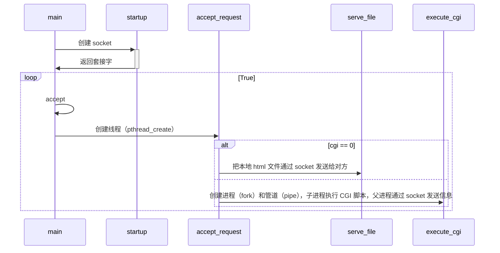

## 1 运行过程




## 2 调用库函数详解

```c
#include <ctype.h>
int isspace(int ch);

#include <string.h>
int strcasecmp (const char *s1, const char *s2);
size_t strlen(const char* str);
char *strcat(char *dest, const char *src)
int strcmp(const char* stri1，const char* str2);
char *strcpy(char* dest, const char *src);
void *memset(void *str, int c, size_t n);

#include <sys/stat.h>
#include <unistd.h>
int stat(const char * file_name, struct stat *buf);

#include <unistd.h>
int dup(int oldfd);
int dup2(int oldfd, int newfd);
int close(int fd);
int execl(const char * path, const char * arg, ...);
ssize_t read(int fd, void *buf, size_t count);
ssize_t write(int fd, const void *buf, size_t count);
int pipe(int filedes[2]);

#include <sys/socket.h>
ssize_t send(int sockfd, const void *buf, size_t len, int flags);
ssize_t recv(int sockfd, void *buf, size_t len, int flags);
int socket(int domain, int type, int protocol);
int accept(int sockfd, struct sockaddr *addr, socklen_t *addrlen);
int listen(int sockfd, int backlog);
int connect(int sockfd, const struct sockaddr *addr, socklen_t addrlen);
int getsockname(int sockfd, struct sockaddr *localaddr, socklen_t *addrlen);
int getpeername(int sockfd, struct sockaddr *peeraddr, socklen_t *addrlen);

#include <stdio.h>
char *fgets(char *s, int size, FILE *stream);
int feof(FILE * stream);
void perror(const char *str);
FILE *fopen(const char *filename, const char *mode);
int fclose(FILE *stream);

#include <sys/types.h>  
#include <sys/wait.h>
pid_t waitpid(pid_t pid, int * status, int options);
    
#include <stdlib.h>
int putenv(const char * string);    

#include <sys/types.h>
#include <sys/socket.h>
int getsockopt(int sock, int level, int optname, void *optval, socklen_t *optlen);
int setsockopt(int sock, int level, int optname, const void *optval, socklen_t optlen);
    
#include <netinet/in.h>
#include <arpa/inet.h>
uint32_t htonl(uint32_t hostlong);
uint16_t htons(uint16_t hostshort);
uint32_t ntohl(uint32_t netlong);
uint16_t ntohs(uint16_t netshort);

#include <pthread.h>
int pthread_create(pthread_t *restrict thread,
                          const pthread_attr_t *restrict attr,
                          void *(*start_routine)(void *),
                          void *restrict arg);

#include<unistd.h>
#include<sys/types.h>
pid_t fork(void);
```

